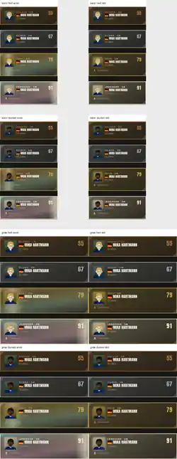

# OPTIK-P2-01 – begrenzte Lesbarkeitsprüfung der Spielerkarten

**Datum:** 18.09.2026  
**Rolle:** Lemming  
**Status:** Prüfbericht zur Astra-Abnahme; keine Produktänderung, keine Gesamtabnahme  
**Basis:** `main` `703d377e8eaa7932b6f5fed62ca313807ad16486` · Version `35.194.1`

## Auftrag und Grenze

Geprüft wurde ausschließlich die Lesbarkeit der **Spielerkarten** als begrenzter Teil von `OPTIK-P2-01`. Verglichen wurden alle vier aktuellen Seltenheiten **Bronze, Silber, Gold und Legendär** in kleiner und großer Darstellung, mit einem hellen und einem dunklen Porträt sowie mit Bewegung an und aus.

Es wurde **kein Produktcode geändert**. Der Bericht bewertet weder Wildcards noch Packs noch die gesamte Barrierefreiheit der App. Android/Touch/Performance wurden nicht geprüft.

## Live-Stand und parallele Arbeit

Vor der Sichtung wurden `START-NEUER-CHAT.md`, `AGENTS.md`, `README.md`, `LEMMING.md` und der aktuelle `CHARAKTER-OPTIK-ARBEITSPLAN.md` aus `main` gelesen. `main` stand vor Beginn und unmittelbar vor der Übergabe auf `703d377` / `35.194.1`.

Parallel liegt `lemming/card-p0-02-packkontur` fünf Commits vor `main`. Der Vergleich zeigt dort nur Arbeitsplan, Pack-Prüfbericht und `tools/browser/packs.spec.js`; `App.jsx` und `karteneffekte.jsx` werden auf diesem Branch nicht verändert. Diese Prüfung bleibt trotzdem ausdrücklich auf den heutigen `main`-Stand beschränkt und integriert die fremde Arbeit nicht.

## Prüfquelle und reproduzierbare Ansichten

Ausgangspunkt war der erfolgreiche GitHub-Actions-Lauf **„Visuelle Browsertests“ #151** auf exakt `703d377` (Run `35324596284`). Verwendet wurde dessen Artefakt `Rasenschach-Browsertest` und darin die erzeugte `.preview/sichtprobe.html` mit der echten `Spielerkarte`-Komponente und dem echten Karten-CSS.

Für die Vergleichsmatrix wurde nur die **temporäre Vorschau-Fixture im Arbeitsspeicher** variiert; Repository- und Produktdateien blieben unverändert:

- Karte: `Mika Hartmann`, `ZM`, Alter 22; Stärke je Galerie-Seltenheit wie im bestehenden Prüfstand.
- kleines Format: `gross={false}`, Prüffläche 260 px breit.
- großes Format: `gross={true}`, Prüffläche 400 px breit.
- helles Porträt: moderner Stil (`stil: 2`), Hautindex 6 (`#F7DDC8`), helle Haare.
- dunkles Porträt: moderner Stil (`stil: 2`), Hautindex 13 (`#493128`), dunkle Haare.
- Bewegung aus: tatsächlicher Galerie-Schalter **„Animationen aus“**; danach waren in den gespeicherten Ansichten keine Kartenanimationen aktiv.
- Bewegung an: echte Materialanimation; für einen reproduzierbaren Screenshot wurden die laufenden Web-Animationen nach dem Rendern bei **2,2 s** pausiert. Das ist ein definierter Moment der Bewegung, nicht die Behauptung eines zeitlichen Worst Case.

### Tatsächlich angesehene Screenshots

**Gemeinsame Matrix – alle acht Kombinationen; jede Zeile enthält alle vier Seltenheiten:**

Die Screenshot-Matrix wurde nach der Erzeugung geöffnet und visuell geprüft. Zusätzlich wurden die acht zugrunde liegenden Einzel-Screenshots einzeln beziehungsweise in der unkomprimierten Gesamtmatrix kontrolliert. Ein erster Hell-Test war wegen einer falschen Palettenauswahl tatsächlich dunkel; diese Bilder wurden verworfen und nach Korrektur der Fixture neu erzeugt.

## Messhinweis

Die Sekundärtexte verwenden im aktuellen Rendering `rgb(160, 155, 140)`; **Alter** steht bei `10.5px`, die Eigenschaft **„Spielmacher“** bei `9.5px`. Zur Einordnung wurde für Gold/Legendär der Hintergrund innerhalb der jeweiligen Textbox zusätzlich ohne Text gerendert und pixelweise gegen diese Vordergrundfarbe gerechnet. Die unten genannten Werte sind der **Median des Hintergrundkontrasts in genau dem gezeigten 2,2-s-Snapshot**, keine vollständige WCAG-Konformitätsprüfung.

Als Orientierung verlangt WCAG 2.2 für normalen Text mindestens **4,5:1** Kontrast: <https://www.w3.org/WAI/WCAG22/Understanding/contrast-minimum.html>.

## Ergebnis über alle Seltenheiten

| Seltenheit | Klein | Groß | Helles/dunkles Porträt | Animation aus | Animation an |
|---|---|---|---|---|---|
| Bronze | Hauptinfo gut lesbar; Alter klein, aber erkennbar | Hauptinfo gut lesbar | kein relevanter Unterschied | stabil | praktisch identisch, da keine Materialanimation |
| Silber | Hauptinfo gut lesbar | Hauptinfo gut lesbar | kein relevanter Unterschied | stabil | praktisch identisch, da keine Materialanimation |
| Gold | Name/OVR gut; Alter/Eigenschaft deutlich schwächer | Name/OVR gut; Eigenschaft bleibt sehr klein | kein relevanter Unterschied am Porträt selbst | Alter knapp, Eigenschaft grenzwertig | Sekundärinfo deutlich ausgewaschen |
| Legendär | Name/OVR gut; Alter/Eigenschaft schon statisch schwach | gleicher Befund; größere Karte hilft Sekundärinfo kaum | kein relevanter Unterschied am Porträt selbst | Sekundärinfo zu kontrastarm | stärkster Lesbarkeitsverlust der Matrix |

## Priorisierte Befunde

### P1 – Gold/Legendär: bewegtes Material senkt den Kontrast der Sekundärinfo stark

**Reproduktion:** kleine oder große Matrix, jeweils linke Spalte „Animation“; Gold und Legendär mit der rechten Spalte „Animation aus“ vergleichen.

Der Materialeffekt liegt technisch bereits **hinter** dem Karteninhalt (`KartenEffekt` mit `zIndex: -1`); das frühere direkte Übermalen des Inhalts ist also nicht mehr das Problem. Die helle wandernde Materialfläche verändert aber den Hintergrund direkt unter dem sehr kleinen grauen Sekundärtext so stark, dass **Alter** und vor allem **„Spielmacher“** zeitweise kaum noch vom Untergrund abheben.

Snapshot-Median bei 2,2 s: 

| Ansicht | Gold Alter | Gold Eigenschaft | Legendär Alter | Legendär Eigenschaft |
|---|---:|---:|---:|----:|
| klein, Animation | 2,22:1 | 2,00:1 | 2,07:1 | 2,25:1 |
| groß, Animation | 2,25:1 | **1,24:1** | 2,09:1 | 2,20:1 |

**Priorität:** **P1 / hoch** innerhalb dieses begrenzten Lesbarkeitspakets. Hauptname und OVR bleiben lesbar; betroffen ist aber echte Karteninformation, nicht reine Dekoration.

**Kleine Lösung:** Materialbewegung beibehalten, aber den **Informationskorridor** hinter Alter/Eigenschaft lokal beruhigen – z. B. mit einer sehr dezenten statischen dunklen Unterlage/Verlauf unter dem Textblock oder einer Maske, die die helle Folienamplitude dort reduziert. Nicht den gemeinsamen Effekt pauschal abschalten und nicht die bereits korrekte Schichtenreihenfolge zurückdrehen.

### P2 – Legendär: Sekundärtext ist auch ohne Animation zu kontrastarm; Gold-Eigenschaft liegt knapp darunter

**Reproduktion:** rechte Spalte „Animation aus“, beide Größen. Legendär zeigt den Befund bei beiden Porträttönen; bei Gold ist besonders die Eigenschaftszeile schwach.

Snapshot-Median ohne Bewegung:

| Ansicht | Gold Alter | Gold Eigenschaft | Legendär Alter | Legendär Eigenschaft |
|---|---:|---:|---:|---:|
| klein, still | 4,57:1 | 4,42:1 | 3,71:1 | 3,49:1 |
| groß, still | 4,55:1 | 4,24:1 | 3,66:1 | 3,23:1 |

Damit ist der Legendär-Befund nicht nur ein Animationsproblem. Der gemeinsame gedämpfte Textton ist auf der helleren legendären Grundfläche sichtbar zu schwach; bei Gold liegt „Spielmacher“ bereits statisch knapp unter der 4,5:1-Orientierung.

**Priorität:** **P2 / mittel**.

**Kleine Lösung:** für Karten-Sekundärinfo einen etwas helleren, kartenspezifischen Textton verwenden – mindestens für Gold/Legendär – statt unverändert `var(--mu)` zu übernehmen. Den Wert gegen die hellste vorgesehene statische Kartenfläche prüfen; so bleibt der Eingriff auf Textfarbe beschränkt.

### P3 – Die Eigenschaft bleibt in klein und groß bei 9,5 px und profitiert nicht von der großen Darstellung

**Reproduktion:** in beiden stillen Matrizen Gold/Legendär verglichen. `gross` vergrößert Porträt, Namen und OVR, die Eigenschaft bleibt jedoch `9.5px`; Alter bleibt `10.5px`.

Dadurch wird die große Karte bei der wichtigsten schwachen Textzeile nicht besser lesbar. Das ist kein Überlaufproblem, sondern verschenkter Platz. Besonders zusammen mit P1/P2 fällt die feste 9,5-px-Zeile unnötig ab.

**Priorität:** **P3 / niedrig bis mittel**.

**Kleine Lösung:** Eigenschaft mindestens auf die Altersgröße anheben (z. B. 10,5–11 px) oder nur bei `gross` leicht vergrößern. Vorzugsweise erst zusammen mit P2 festlegen, damit Größe und Farbe nicht unabhängig gegeneinander optimiert werden.

## Positive Befunde / bewusst keine Baustelle eröffnet

- **Bronze und Silber:** Name, Seltenheitslabel und OVR sind in klein/groß und bei beiden Porträttönen klar lesbar. Der Animationsschalter verändert diese Stufen nicht sichtbar, weil dort kein Gold-/Legendär-Materialeffekt läuft.
- **Porträtton:** Das helle und dunkle Testporträt bleibt auf allen vier Seltenheiten erkennbar. Der eigene Porträtuntergrund trennt das Gesicht ausreichend von der Kartenfläche; aus dieser Stichprobe ergibt sich **kein eigener Hell/Dunkel-Fix**.
- **Primärinformation Gold/Legendär:** Spielername und OVR bleiben auch im gezeigten Animationsmoment deutlich. Es besteht kein Anlass, die komplette Spezialoptik zu entfernen.
- **Seltenheit nicht nur über Farbe:** Jede Karte nennt die Seltenheit als Text (`BRONZE`, `SILBER`, `GOLD`, `LEGENDÄR`) und besitzt unterschiedliche Rahmen/Materialwirkung. Für diese Information wurde kein rein farblicher Zwang beobachtet.
- **Ruhemodus in dieser Matrix:** Mit „Animationen aus“ stand die Kartenmaterialbewegung still. Das ist nur ein Nebenbefund dieser Kartenprüfung, keine vollständige Abnahme von `OPTIK-P0-01`.

## Bewusst nicht geprüft

- Android-WebView, Touch, Geräteleistung und Displaykalibrierung.
- Farbfehlsichtigkeits-Simulation und systematische Zoom-/Schriftgrößenprüfung.
- sehr lange Spielernamen, andere Sprachen oder zusätzliche Kartentexte.
- Wildcards, Elfkarte und Packs.
- vollständiger Animationszyklus als automatisierte Minimum-Kontrastmessung; die Screenshots fixieren bewusst einen reproduzierbaren Zeitpunkt.

## Übergabe an Astra

Dieser Branch enthält nur diesen Bericht und die belegende Screenshot-Matrix. **Keine Lösung wurde umgesetzt.** Die drei kleinen Lösungsvorschläge sind bewusst getrennt, damit Astra entscheiden kann, ob P1/P2 gemeinsam als gezielter Karten-Lesbarkeitspatch umgesetzt werden und ob P3 dabei mitgenommen wird.

**Status:** zur Astra-Abnahme, noch nicht integriert. Keine Gesamtabnahme von `OPTIK-P2-01`, kein `main`-Merge, kein Release.
